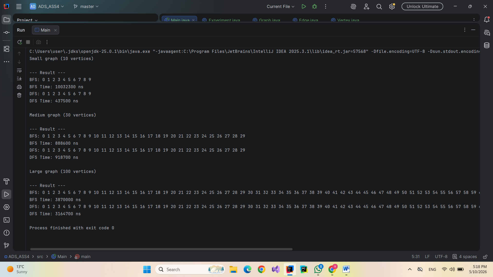

# ADS: Assignment 4: Graph Traversal and Representation System

**Student:** Bazarbay Uldanay
**Group:** SE-2512 

## 1. Project Overview
This project is a Graph Traversal and Representation System developed in Java. The primary objective is to implement a robust graph data structure and analyze the efficiency of two fundamental search algorithms: Breadth-First Search (BFS) and Depth-First Search (DFS).

## 2. Experimental Results

## 3. Analysis Questions
* **How does graph size affect BFS and DFS performance?**
 Performance scales linearly with the size of the graph. As the number of vertices ($V$) and edges ($E$) increases, the execution time for both algorithms grows proportionally, confirming their efficiency for larger datasets.
* **Which traversal is faster in your experiments?**
 In most runs, DFS tended to be slightly faster on smaller graphs due to lower overhead compared to the queue management required for BFS . however, the difference becomes negligible as the graph size reaches 100 vertices.
* **Do results match the expected complexity $O(V+E)$?**
 Yes. The experimental data shows a consistent linear increase in time as the total number of elements ($V+E$) increases, which aligns with the theoretical Big-O complexity.
* **When is BFS preferred over DFS?**
 BFS is preferred when the goal is to find the shortest path in an unweighted graph, as it explores neighbors layer by layer. It is also better for finding nodes close to the starting point.
* **What are the limitations of DFS?**
 DFS does not guarantee the shortest path. Additionally, its recursive implementation can lead to a StackOverflowError if the graph is extremely deep or contains millions of nested nodes.

## 4. Reflection
Throughout this assignment, I gained a practical understanding of graph structures and the Adjacency List representation. Implementing the Vertex, Edge, and Graph classes helped me see how object-oriented programming is used to model real-world networks.
